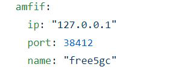
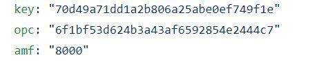

# my5G-RANTester: NGAP/NAS Test tool.

my5G-RANTester is a GNB/UE simulator for testing 3GPP standard and stress in 5G core. 

## Installation

**Requirements**

my5gRANTester is built and tested with Go 1.14.4.

**Steps**

Downloading source code:
```
git clone https://github.com/LABORA-INF-UFG/my5G-RANTester.git
```

Install dependencies:
```
cd my5g-RANTester
go mod download 
```
  
Build binary:
```
cd cmd 
go build app.go
```
  
Edit configuration file in config/config.yml:

Change amfif with AMF ip, port and core name that you are testing. In the moment we have two options: free5gcore or open5gs
<p align="center">
     
</p>
Change upif with UPF ip and port(N3).
<p align="center">
    
</p>
Check the values in UE(opc,key,amf). This values must be registered by webconsole core and my5gRANTester will use them in all tests.
<p align="center">
    
</p>
Keep attention about imsi because some tests was automatized(load-tests) and will not permit change. Read more below.
  

## Tests

**Running with template:**
```
cd cmd
./app <with flag that identify type of test>
```

We have now different types of test for testing some kinds of behaviors from Core, that are show below.

- Load-test with UEs in queue*
    - You can use the command to test with number of UEs:
            ``` 
              ./app load-test -n <number of UEs>  
            ```
    - For example for testing with 3 UEs:
            ``` 
              ./app load-test -n 3  
            ```
   
- Load-test with UEs attached at the same time(concurrency) using a unique GNB* 
    - You can use the command to test with number of UEs: 
                ``` 
                 ./app load-test -t -n <number of UEs>  
                ```
    - You can use the command to test with 3 UEs:
              ``` 
                ./app load-test -t -n 3  
              ```
    
- Load-test with UEs attached at the same time(concurrency) using a GNB per UE* 
    - You can use the command to test with number of UEs: 
             ``` ./app load-test -g -n <number of ues> ```
    - You can use the command to test with 3 GNBs, each one with an UE:
             ``` ./app load-test -g -n 3 ```

- Load test with UEs attached at the same time based a poisson and exponential distribution*
              
- Load-test with GNBs 
    - You can use the command to test 10 GNBs attached to core: 
              ``` ./app gnb -g 10  ```            
    - Configurations in config/config.yml.
    
- Test with an UE and a GNB. 
     - You can use command to test: 
              ``` ./app ue ```
     - Configurations in config/config.yml.

## Additional comments
   
For tests with * imsi UEs was automatized and you have to include them in web UI of test core as show below.
- Example: if you want to test 10 UEs you have to included imsi UE range to 2089300000001 from 2089300000010 in web UI. You can change other values in config/config.yml for example opc,k as you interest and used them in testing but imsi and hplmn will follow the range above.
- Example: if you want to test 2 UEs you have to include imsi 2089300000001 and 2089300000002 in web UI of test core.


