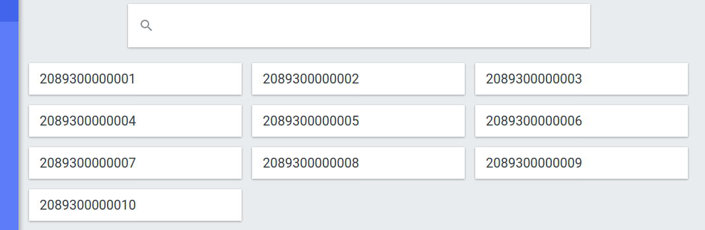

# my5G-RANTester


 
  


- [Description](#description)
- [Installation](#installation)
    - [Recommended environment](#recommended-environment)
    - [Requirements](#requirements)
    - [RAN Tester](#ran-tester)
- [Check](#check)
- [More information](#more-information)

----
# Description

my5G-RANTester is a tool for emulating control and data planes of the UE (user equipment) and gNB (5G base station). my5G-RANTester follows the 3GPP Release 15 standard for NG-RAN (Next Generation-Radio Access Network). Using my5G-RANTester, it is possible to generate different workloads and test several functionalities of a 5G core, including its complaince to the 3GPP standards. Scalability is also a relevant feature of the my5G-RANTester, which is able mimic the behaviour of a large number of UEs and gNBs accessing simultaneously a 5G core. Currently, the wireless channel is not implemented in the tool.

If you want to cite this tool, please use the following information:
```
@misc{???,
    title={???},
    author={???},
    year={2020},
    eprint={???},
    archivePrefix={arXiv},
    primaryClass={cs.NI}
}
```
If you have questions or comments, please email us: [my5G team](mailto:my5G.initiative@gmail.com). 

my5G-RANTester borrows libraries and data structures from the [free5gc project](https://github.com/free5gc/free5gc).

----
# Installation

## Recommended environment

* CPU type: x86-64 (specific model and number of cores only affect performance)
* RAM: 1 GB
* Operating System (OS): Linux Ubuntu 18.04 or 20.04 LTS.

The installation can be done directly in the host OS or inside a virtual machine (VM).


## Requirements

Install GCC:
```
sudo apt update && apt -y install build-essential
```

Install GSL:
```
sudo apt -y install libgsl-dev
```

Install Go:
```
???
```

## RAN Tester

Download the source code:
```
git clone https://github.com/LABORA-INF-UFG/my5G-RANTester.git
```

Install the dependencies:
```
cd my5G-RANTester
go mod download
```
  
Build the binary:
```
cd cmd 
go build app.go
```

Edit configuration file **config/config.yml** and make the following procedures.

1. Configure **amfif** with the AMF IP address, port and core name that you are testing. Currrently, there are three options for **name**: my5g-core, free5gc or open5gs.
```yaml
amfif:
  ip: "127.0.0.1"
  port: 38412
  name: "free5gc"
```

2. Change upif with UPF ip and port(N3).
```yaml
upfif:
  ip: "10.200.200.102"
  port: 2152
```

Check the values in UE(opc,key,amf). This values must be registered by webconsole core and my5gRANTester will use them in all tests.
```yaml
  key: "70d49a71dd1a2b806a25abe0ef749f1e"
  opc: "6f1bf53d624b3a43af6592854e2444c7"
  amf: "8000"
```

Keep attention about imsi because some tests was automatized(load-tests) and will not permit change. If you are using free5gcore you can using script in /dev/includes_ues.sh to added imsi and other information by webconsole. As show below:
```
   ./included_ues.sh -n <number of UEs that you want to test in load tests>  
```

  
----
# Check

**Running with template:**
```
cd cmd
./app <with flag that identify type of test>
```

If you get this error:
```
./app: error while loading shared libraries: libgsl.so.25: cannot open shared object file: No such file or directory
```

Please check the path of the GSL dynamic library:
```
LD_LIBRARY_PATH=$LD_LIBRARY_PATH:/usr/local/lib/gsl/
export LD_LIBRARY_PATH
./app
```

We have now different types of test for testing some kinds of behaviors from Core, that are show below.

- Load-test with UEs in queue*
    - You can use the command to test with number of UEs:
            ``` 
              ./app load-test -n <number of UEs>  
            ```
    - For example for testing with 3 UEs:
            ``` 
              ./app load-test -n 3  
            ```
   
- Load-test with UEs attached at the same time(concurrency) using a unique GNB* 
    - You can use the command to test with number of UEs: 
                ``` 
                 ./app load-test -t -n <number of UEs>  
                ```
    - You can use the command to test with 3 UEs:
              ``` 
                ./app load-test -t -n 3  
              ```
    
- Load-test with UEs attached at the same time(concurrency) using a GNB per UE* 
    - You can use the command to test with number of UEs: 
             ``` ./app load-test -g -n <number of ues> ```
    - You can use the command to test with 3 GNBs, each one with an UE:
             ``` ./app load-test -g -n 3 ```

- Nonlinear load test with UEs attached at the same time based a poisson and exponential distribution*
   - You can use the command to test:
         ``` 
         ./app nlinear-tests -s <samples> -mu <mean> -se <seed>  
         ```
   - Each samples is a random number generate by poisson distribution and means number of UEs attached to Core at the same time.
   - Between each sample has a time duration in seconds defined by Exponential Distribution 
   - Mean and seed is used by Poisson and exponential distribution for generate random numbers.           
- Load-test with GNBs 
    - You can use the command to test 10 GNBs attached to core: 
              ``` ./app gnb -n 10  ```            
    - Configurations in config/config.yml.
    
- Test with an UE and a GNB. 
     - You can use command to test: 
              ``` ./app ue ```
     - Configurations in config/config.yml.

## Additional comments
   
For tests with * imsi UEs was automatized and you have to include them in web UI of test core as show below. 

Example: if you want to test 10 UEs you have to included imsi UE range to 2089300000001 from 2089300000010 in web UI. You can change other values in config/config.yml for example opc,k as you interest and used them in testing but imsi and hplmn will follow the range above.
  <p align="">
      
  </p>
Example: if you want to test 2 UEs you have to include imsi 2089300000001 and 2089300000002 in web UI of test core.
 <p align="">
     
 </p>
